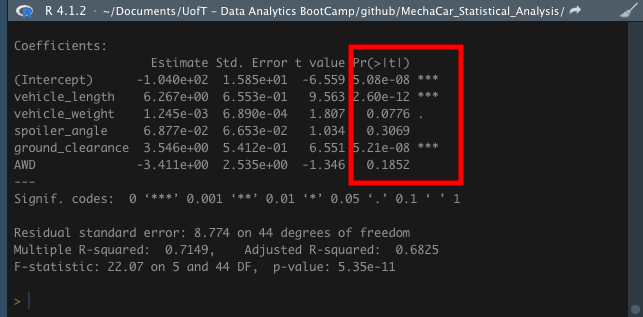
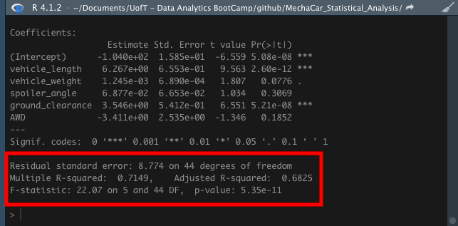
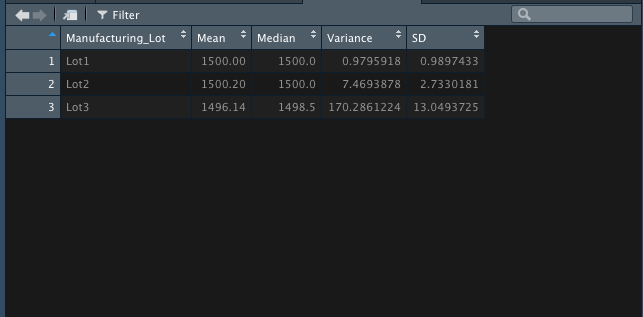
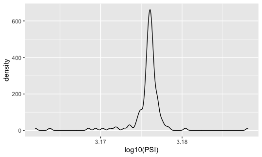
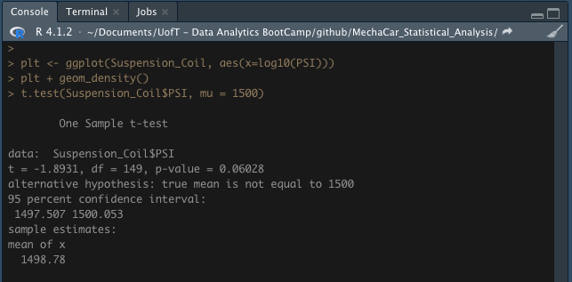
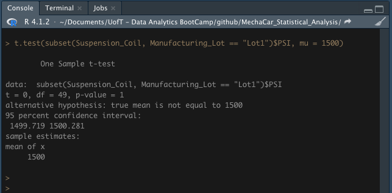
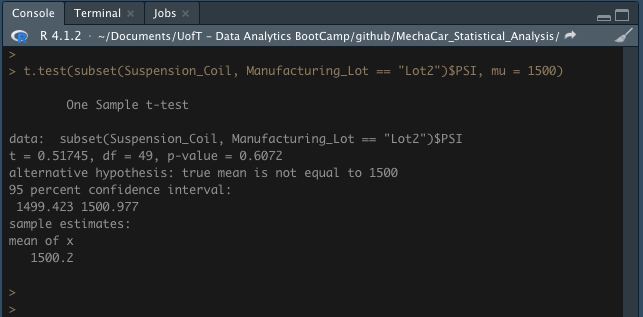

# MechaCar Statistical Analysis

## Background

A few weeks after starting his new role, Jeremy is approached by upper management about a special project. AutosRUs’ newest prototype, the MechaCar, is suffering from production troubles that are blocking the manufacturing team’s progress. AutosRUs’ upper management has called on Jeremy and the data analytics team to review the production data for insights that may help the manufacturing team.

Help Jeremy and the data analytics team do the following:

Perform multiple linear regression analysis to identify which variables in the dataset predict the mpg of MechaCar prototypes
Collect summary statistics on the pounds per square inch (PSI) of the suspension coils from the manufacturing lots
Run t-tests to determine if the manufacturing lots are statistically different from the mean population
Design a statistical study to compare vehicle performance of the MechaCar vehicles against vehicles from other manufacturers. For each statistical analysis, you’ll write a summary interpretation of the findings.

## Overview of Project

### Purpose

Deliverable 1: Linear Regression to Predict MPG
Deliverable 2: Summary Statistics on Suspension Coils
Deliverable 3: T-Test on Suspension Coils
Deliverable 4: Design a Study Comparing the MechaCar to the Competition

## Analysis And Challenges

## Methodology: Analytics Paradigm

#### 1. Decomposing the Ask

#### 2. Identify the Datasource
* MechaCar_mpg.csv
* Suspension_Coil.csv

### 3. Define Strategy & Metrics
**Resource:** R, dplyr

#### 4. Data Retrieval Plan
Stated in [2. Identify the Datasource](#2-identify-the-datasource)

#### 5. Assemble & Clean the Data

#### 6. Analyse for Trends

#### 7. Acknowledging Limitations

#### 8. Making the Call:
The "Proper" Conclusion is indicated below on [Summary](#summary)

## Analysis

## Summary

## Linear Regression to Predict MPG

1. Which variables/coefficients provided a non-random amount of variance to the mpg values in the dataset?

* H0 : The different variables in the dataset does not predict the mpg of MechaCar prototypes
* Ha : The different variables in the dataset predicts the mpg of MechaCar prototypes

The variables/coefficients below (each Pr(>|t|) value) provided a non-random amount of variance to the mpg values in the dataset.

>LM

* vehicle_length : 2.60e-12 (2.60 x 10-12 = 0.00000000000260)
* vehicle_weight : 0.0776
* ground clearance : 5.21e-08b (5.21 x 10-8 = 0.0000000521)

According to results, these variables are statistically unlikely to provide random amounts of variance to the linear model. That means, vehicle_length, vehicle_weight and ground clearance vehicle have a significant impact on mpg.

2. Is the slope of the linear model considered to be zero? Why or why not?

* H0 : The slope of the linear model is zero, or m = 0
* Ha : The slope of the linear model is not zero, or m ≠ 0

>P-val

* p-value : 5.35e-11 (5.35 x 10-11 = 0.0000000000535)
* Assumed significance level is: 0.05%

The p-value is smaller than assumed significance level. Therefore, we can state that there is sufficient evidence to reject our null hypothesis, which means that the slope of our linear model is not zero.

3. Does this linear model predict mpg of MechaCar prototypes effectively? Why or why not?

From our linear regression model, the r-squared value is 0.71, which means that roughly 71% of the variability of our dependent variable (mpg predictions) is explained using this linear model, which suggests there is a strong positive correlation between MPG and the variables of vehicle length, vehicle weight, spoiler angle, ground clearance, and AWD.

## Summary Statistics on Suspension Coils

1. The design specifications for the MechaCar suspension coils dictate that the variance of the suspension coils must not exceed 100 pounds per square inch. Does the current manufacturing data meet this design specification for all manufacturing lots in total and each lot individually? Why or why not?

>Summarize

The total variance of the suspension coils is 62.29 for all manufacturing lots in total. This is within MechaCar design specifications.

>Group_by

Variance of the suspension coils must not exceed 100 pounds per square inch.
Lots 1 and 1 are within the designs specifications.
Lot 3 variance for suspension coils is 170.28, which exceeds 100 pounds per square inch. Therefore Lot 3 did not meet design specifications.

## T-Tests on Suspension Coils

1. Determine if all manufacturing lots and each lot individually are statistically different from the population mean of 1,500 pounds per square inch.

* H0 : There is no statistical difference between the observed sample mean and its presumed population mean.
* Ha : There is a statistical difference between the observed sample mean and its presumed population mean.

>All Lots Graph

Normal distribution, or normality, is commonly referred to as "the bell curve," and describes a dataset where values farther from its mean occur less frequently than values closer to its mean.
The distribution of the suspension coil is visualised with a density plot which assumes an approximate normal distribution with the bell curve. 

>All Lots

data:  Suspension_Coil$PSI
t = -1.8931, df = 149, p-value = 0.06028
alternative hypothesis: true mean is not equal to 1500
95 percent confidence interval:
 1497.507 1500.053
sample estimates:
mean of x
  1498.78

>Lot 1

>Lot 2

>Lot 3

## Study Design: MechaCar vs Competition

What metric or metrics are you going to test?
What is the null hypothesis or alternative hypothesis?
What statistical test would you use to test the hypothesis? And why?
What data is needed to run the statistical test?

## Appendix

Hypothesis Testing in Five Steps
Regardless of the complexity of the dataset or the proposed question, hypothesis testing uses the same five steps:

Generate a null hypothesis, its corresponding alternate hypothesis, and the significance level.
Identify a statistical analysis to assess the truth of the null hypothesis.
Compute the p-value using statistical analysis.
Compare p-value to the significance level.
Reject (or fail to reject) the null hypothesis and generate the conclusion.
Keep in mind that the null and alternate hypotheses are used to explain one of two outcomes from our proposed question, and both are mutually exclusive and exhaustive. In other words, no matter what, one of these statements must be used to explain our analysis results.
